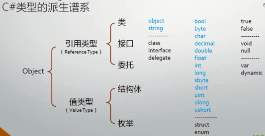
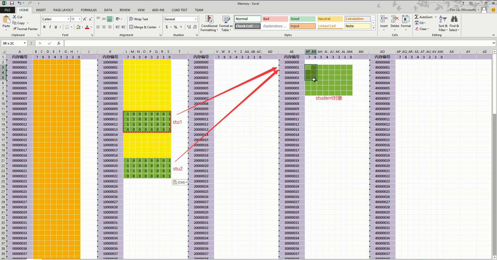
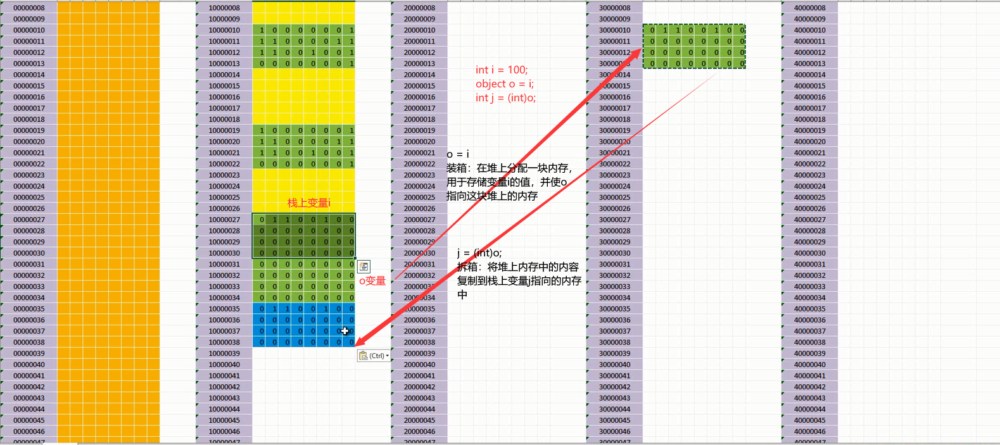
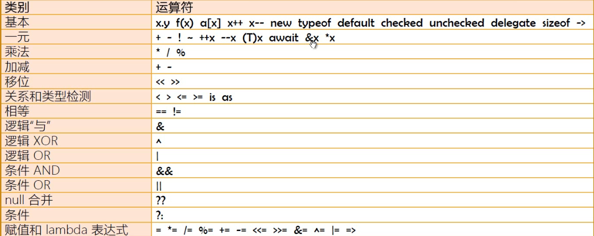
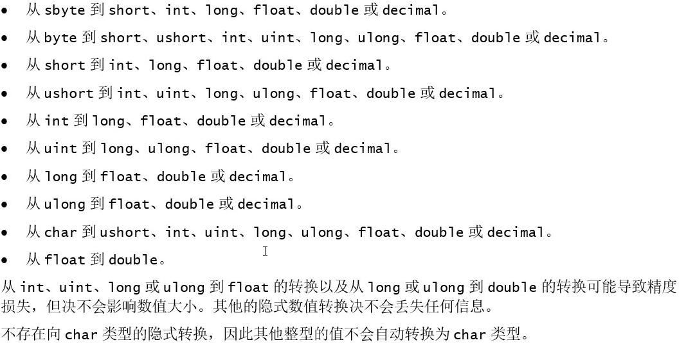
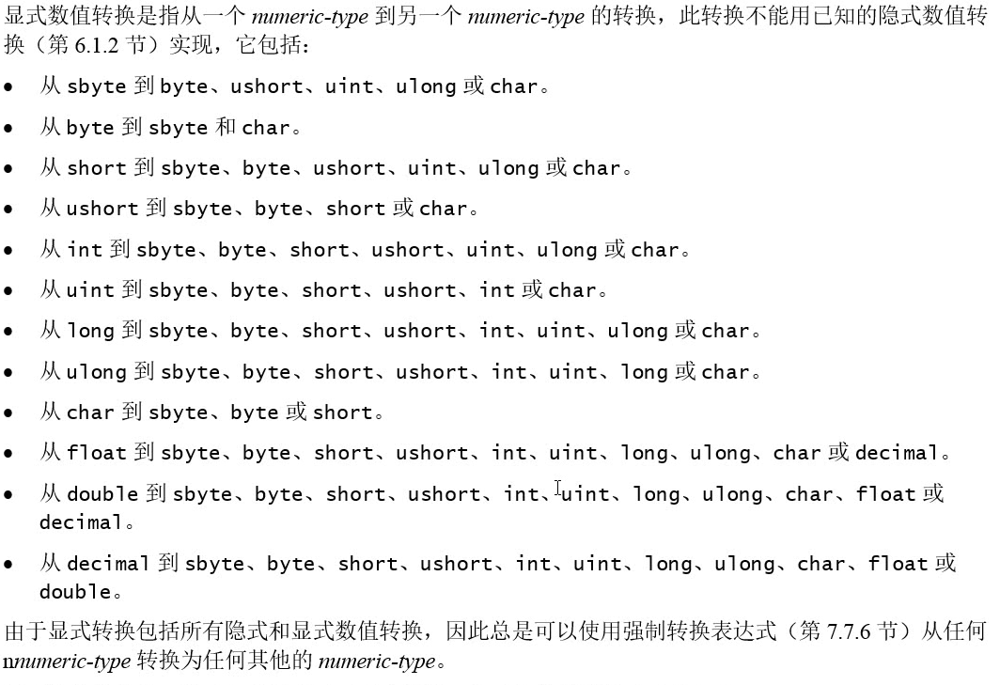
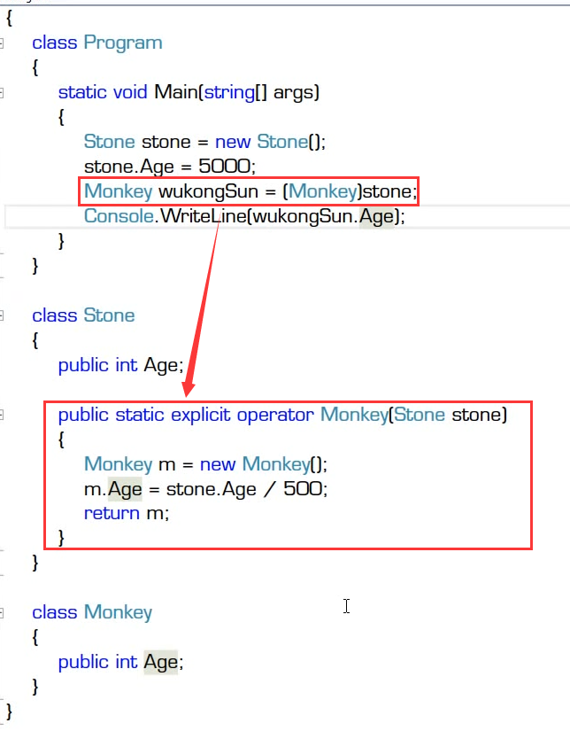
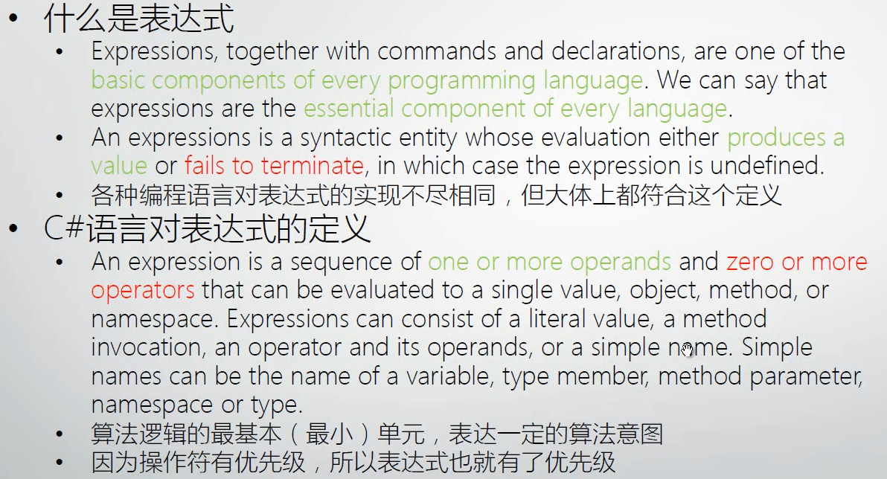
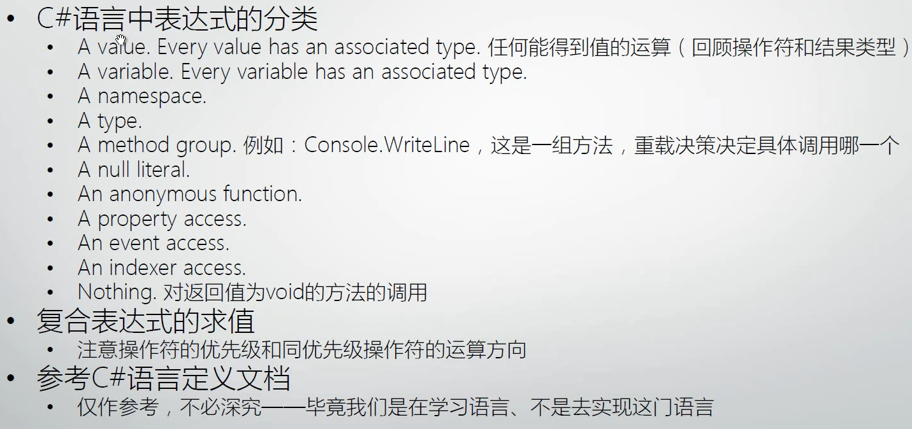

# C#语言入门详解  

> 类型、变量与对象  

### C#的五大数据类型  

* 类
* 结构体
* 枚举
* 接口
* 委托  
  

### 变量、对象与内存  

* 什么是变量  
  变量表示了存储位置，并且每个变量都有一个类型，以决定什么样的值能够存入变量  
* 变量一共有7种  
  静态变量、实例变量（成员变量、字段）、数组元素，值参数，引用参数，输出形参，局部变量  

> 变量 = 以变量名所对应的内存地址为起点、以其数据类型所要求的存储空间为长度的一块内存区域  

* 值类型的变量  
  值类型没有实例
* 引用类型的变量与实例  
  引用类型变量与实例的关系：引用类型变量里存储的数据是对象的堆内存地址  
  
* 局部变量是在stack上分配内存  
* 变量的默认值  
* 装箱与拆箱  
  > 装箱：将栈中的变量拷贝到堆中  
  > 拆箱：将堆中的对象转换为栈中的类型  
  

***  
## 方法的由来  

* 方法的前身是C/C++语言的函数  
  方法是面向对象范畴的概念
* 永远都是类（或结构体）的成员  
* 是类（或结构体）最基本的成员之一  
* 为什么需要方法和函数  
  * 隐藏复杂的逻辑  
  * 把大算法分解为小算法  
  * 复用（reuse，重用）  

## 方法的声明与调用  

* 声明  
  * Parameter全称为“formal parameter”，形式上的参数，简称“形参”
* 方法的命名规范  
  * 大小写规范
  * 需要以动词或者动词短语作为名字  
* 调用方法  
  * Argument翻译为“实际参数”，简称“实参”  
  * 调用方法时的argument列表要与定义方法时的parameter列表相匹配  

***  

## 构造器  

* 构造器（constructor）是类型的成员之一  

## 方法重载（Overload）  

* 方法签名（method signature）由方法的名称、类型形参的个数和它的每一个形参（按从左到右的顺序）的类型和种类（值、引用或输出）组成
  * 方法签名不包含返回类型  
* 重载决策（到底调用哪一个重载）用于在给定了参数列表和一组候选函数成员的情况下，选择一个最佳函数成员来实施调用  

# 方法的调用与栈  

* **stackframe**  

# 操作符详解  

## 操作符概览  

  

* 操作符(Operator)也译为运算符  
* 操作符是用来操作数据的，被操作符操作的数据称为操作数(Operand)  

## 操作符的本质  

* 操作符的本质是函数（即算法）的“简计法”  
* 操作符不能脱离与它关联的数据类型  

## 优先级与运算顺序  

* 操作符的优先级  
  * 可以试用圆括号提高被括起来表达式的优先级  
  * 圆括号可以嵌套  
* 同优先级操作符的运算顺序  
  * 除了带有赋值功能的操作符，同优先级操作符都是由左向右进行计算  
  * 带有赋值功能的操作符的运算顺序是由右向左  

## 类型转换  

* 隐式类型转换(implicit)  
  * 不丢失精度的转换  
  * 子类向父类的转换  
  * 装箱  
  public static implicit operator [转换类型](被转换类型)  
  
* 显示类型转换(explicit)  
  * 有可能丢失精度（甚至发生错误）的转换，即cast  
  * 拆箱  
  * 使用Convert类  
  * ToString方法与各数据类型的Parse/TryParse方法  
  public static explicit operator [转换类型](被转换类型)  
    
  
* 自定义类型转换操作符  

# 表达式、语句详解  

## 表达式的定义  

  

## 各类表达式概览  

  

